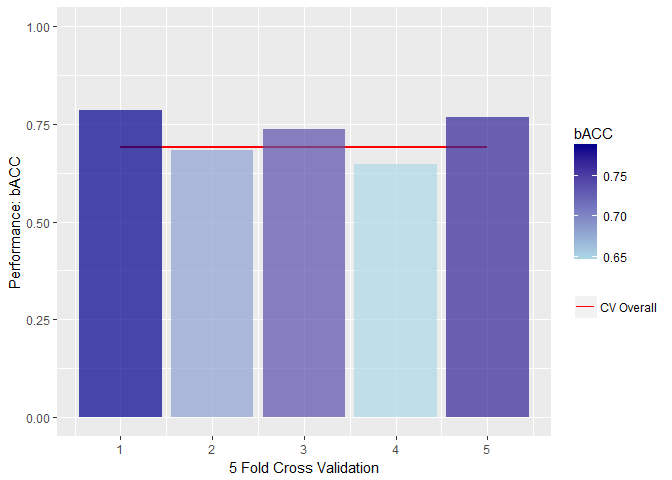
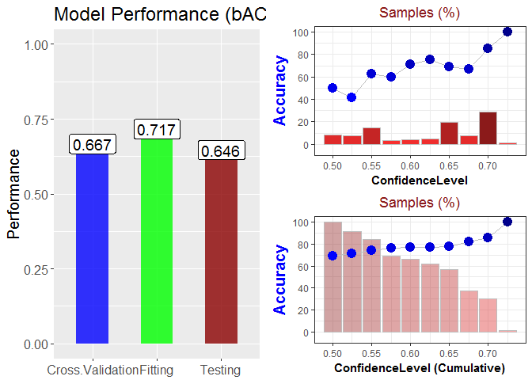

Dforest
=======

Introduction
------------

Dforest is a R-implementation of Decision Forest algorithm that combines
the predictions of multiple independent decision tree models for a
consensus decision. In particular, Decision Forest is a novel
pattern-recognition method which can be used to analyze:

1.  DNA microarray data;
2.  Surface-Enhanced Laser Desorption/Ionization Time-of-Flight Mass
    Spectrometry (SELDI-TOF-MS) data; and
3.  Structure-Activity Relation (SAR) data.

In this package, three fundamental functions are provided, as

1.  DF\_train,
2.  DF\_pred, and
3.  DF\_CV.

run Dforest() to see more instructions.

**Reference**  
[Tong, Weida, et al. "Decision forest: combining the predictions of
multiple independent decision tree models." Journal of Chemical
Information and Computer Sciences 43.2 (2003):
525-531.](http://pubs.acs.org/doi/abs/10.1021/ci020058s)

Index of Functionality
----------------------

First, simply install and load Dforest package into your R environment:

    if (!require(Dforest)){
      install.packages("Dforest",repos = "https://cran.r-project.org/")
    }

    ## Loading required package: Dforest

    library(Dforest)

#### Training Decision Forest Model - DF\_train

DF\_train() is used to train Decision Forest model based on training
dataset.  
Here is an simple example for using this function.

      data(demo_simple)
      # for simplicity, we only used two-classes classification.
       X <- subset(data_dili$X, data_dili$Y!="Less-DILI-Concern")
       Y <- subset(data_dili$Y, data_dili$Y!="Less-DILI-Concern") 
       names(Y)=rownames(X)

       random_seq=sample(nrow(X))
       split_rate=3
       split_sample = suppressWarnings(split(random_seq,1:split_rate))
       Train_X = X[-random_seq[split_sample[[1]]],]
       Train_Y = Y[-random_seq[split_sample[[1]]]]
       Test_X = X[random_seq[split_sample[[1]]],]
       Test_Y = Y[random_seq[split_sample[[1]]]]
       used_model = DF_train(Train_X, Train_Y)

Here is the structure of built Decision Forest Model:

    ##             Length Class  Mode     
    ## performance   3    -none- list     
    ## pred        652    -none- numeric  
    ## detail       90    -none- list     
    ## models       15    -none- list     
    ## Method        1    -none- character
    ## cp            1    -none- numeric

Where the performance stored the *Fitting* performance of training
process.  
Let's take a look:  
- The Accuracy (ACC) is 0.776;  
- The Matttews' Correlation Coefficient (MCC) is 0.5239851;  
- The Balanced Accuracy (bACC) is 0.7411364.

Due to the dataset we used here, we found that *DILI* is not a well
predicted endpoint!

OK, now let's see how about the performance on testing dataset.

    Pred_result = DF_pred(used_model,Test_X,Test_Y)

Similarly, let's take a look at the predicting performance:  
- The Accuracy (ACC) is 0.644;  
- The Matttews' Correlation Coefficient (MCC) is 0.2478768;  
- The Balanced Accuracy (bACC) is 0.6105458.

Compared the result from training and testing performance:

    ##            ACC   MCC  bACC
    ## Training 0.776 0.524 0.741
    ## Testing  0.644 0.248 0.611

#### Cross validation analysis

Sometime, you want to run cross validation analysis on the entire
dataset.

    CV_result = DF_CV(Train_X, Train_Y)
    DF_CVsummary(CV_result,plot = T)

    ## Overall 5-fold Cross-Validation result: 0.676
    ## Most 5 used features: D015, D123, D144, D249, D563
    ## Top 5 frequencies in (5): 5, 5, 5, 5, 5

Finally, Let's see something Fancy with only one command.

    Result = DF_easy(Train_X, Train_Y, Test_X, Test_Y)

